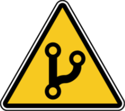

<div align="center">
  <h1>Lint Branch Name</h1>
  
  <p>Flexible git branch name linter with some extra validating features</p>
<a href="https://codeclimate.com/github/b12k/lint-branch-name/maintainability"></a>
</div>

## Usage

### Globally
```shell
> npm install lint-branch-name -g
> lint-branch-name
```

### As development dependency
```shell
> npm install lint-branch-name -D
> npm set-script lint:branch-name "lint-branch-name"
```

### Git hook
```shell
> npm install lint-branch-name simple-git-hooks -D
> npm set-script lint:branch-name "lint-branch-name"
```
`package.json`
```json
{
  "simple-git-hooks": {
    "pre-push": "npm run lint:branch-name"
  }
}
```

### No install

```shell
> npx lint-branch-name
```


## Configuration

### Config interface

```typescript
interface Config {
  pattern: string;
  params: Record<string, string[]>;
  prohibited: string[];
}
```

### User provided configuration

Under the hood **LintBranchName** uses [cosmicconfig](https://www.npmjs.com/package/cosmiconfig) to load its configuration.

You can create one of the following:
- `lintbranchname` property in the `package.json` file
- Extensionless "rc file" in `.json` or `.yaml` format
  - `.lintbranchnamerc`
- "rc file" with `.json` or `.yaml` extensions
  - `.lintbranchnamerc.json`
  - `.lintbranchnamerc.yaml`
- "rc file" with `.js` extension
  - `.lintbranchnamerc.js`
- ".config.js" file
  - `lintbranchname.config.js`

> don't forget to do `module.exports = {...}` in `.js` config files

**LintBranchName** will merge found configuration with its defaults.

### Default configuration

```javascript
module.exports = {
  pattern: ':type/:name',
  params: {
    type: [
      'feature',
      'fix',
      'misc',
      'docs',
    ],
    name: ['[a-z0-9-]+'],
  },
  prohibited: [
    'master',
    'main',
    'build',
    'test',
    'wip',
    'ci',
    'release',
  ],
};
```

### Linting

**LintBranchName** uses [path-to-regexp](https://www.npmjs.com/package/path-to-regexp) to check if branch name
matches the `pattern` provided in config.

Firstly branch name will be checked if its `prohibited` or not. On the next step, if `params` are provided,
`pattern` parts will be modified/populated using respective keys. For example:
```
(default configuration)
:type/:name => :type(feature|fix|misc|docs)/:name([a-z0-9-]+)
```

Please refer to [path-to-regexp](https://www.npmjs.com/package/path-to-regexp) docs for advanced patterns.

## Configuration recipes

### Only check for protected branches

```typescript
module.exports = {
  pattern: '', // or other falsy value: undefined | 0 | null | false
  params: {},
  prohibited: [
    'master',
    'main',
    'build',
    'test',
    'wip',
    'ci',
    'release',
  ],
};
```

### Dot-separated username & issue id

`b12k.fix/example-branch-description/lbn-12345`

```typescript
module.exports = {
  pattern: ':username.:type/:desc/:issue',
  params: {
    type: [
      'feature',
      'fix',
      'misc',
      'docs',
    ],
    issue: ['lbn-[a-z0-9-]+'],
  },
  prohibited: [
    'master',
    'main',
    'build',
    'test',
    'wip',
    'ci',
    'release',
  ],
};
```

### Scopes for monorepo

`feature/my-awesome-app/yet-another-great-feature`

```
(imaginary monorepo structure)
root/
    apps/
        my-awesome-app
        another-great-app
    libs/
        very-useful-lib
        shared-lib
    .lintbranchnamerc.js
```

```typescript
const fs = require('fs');

const readDirectories = (path) => fs
  .readdirSync(path, { withFileTypes: true })
  .filter((file) => file.isDirectory())
  .map(({ name }) => name);

module.exports = {
  pattern: ':type/:scope/:description',
  params: {
    type: [
      'feature',
      'fix',
      'misc',
      'docs',
    ],
    scope: readDirectories('./apps')
  },
  prohibited: [
    'master',
    'main',
    'build',
    'test',
    'wip',
    'ci',
    'release',
  ],
};
```
